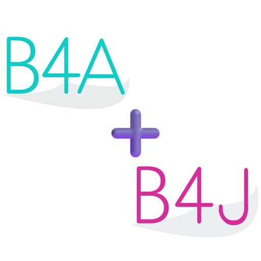
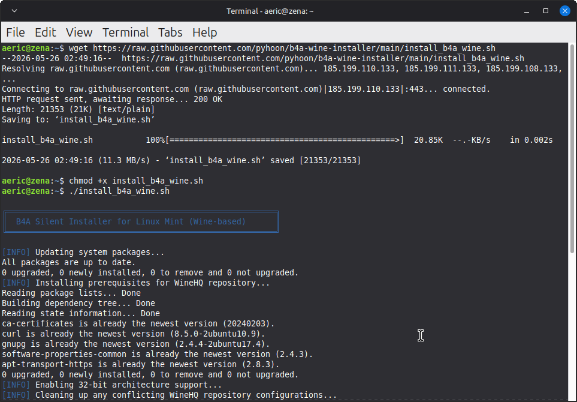
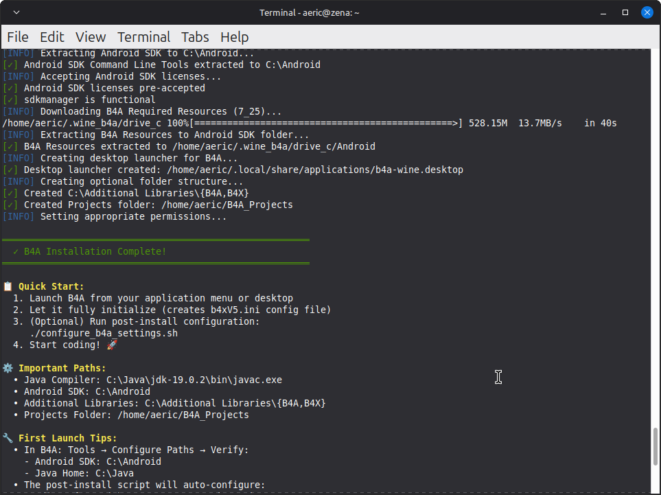

# b4x-wine-installer

[](https://linuxmint.com/)
[](https://winehq.org/)
[](https://www.b4x.com/b4a.html)
[](https://www.b4x.com/b4j.html)
[](LICENSE)

🎯 Install **B4A** and **B4J** on Linux Mint using Wine with a single, configurable script.





## 📑 Table of Contents
- [✨ Features](#-features)
- [🚀 Quick Start](#-quick-start)
- [⚙️ Configuration Details](#️-configuration-details)
- [⚙️ Post-Installation Configuration](#️-post-installation-configuration)
- [📁 Folder Structure](#-folder-structure)
- [🗑️ Uninstall](#%EF%B8%8F-uninstall)
- [🔍 Troubleshooting](#-troubleshooting)
- [📚 Resources](#-resources)

## ✨ Features
- ✅ Unified installer for **B4A**, **B4J**, or **Both** in a single Wine prefix
- ✅ Interactive menu or silent CLI flags (`--b4a`, `--b4j`, `--all`)
- ✅ Fully configurable paths via editable variables or environment overrides
- ✅ Installs Wine Stable, Winetricks, .NET 4.5.2, VC++ 2010, DXVK & GDI
- ✅ Downloads & extracts JDK 19, Android SDK Command Line Tools, and B4A Resources
- ✅ Creates desktop launchers, icons, and shared `Additional Libraries` folders
- ✅ Safe uninstaller with `--dry-run`, `--keep-projects`, and `--keep-wine` options

## 🖥️ System Requirements

- **Linux Mint 21.x** (Vanessa/Vera/Victoria/Virginia) or **22.x** (Wilma/Xia/Zara/Zena)
- **64-bit architecture** (with 32-bit support enabled)
- **Internet connection** for downloads
- **~4.8 GB free disk space** (Wine prefix + JDK + B4A + B4J + Android SDK + B4A Resources)
- **sudo privileges** for system package installation

## 🚀 Quick Start

### 1. Download & Run
```bash
wget https://raw.githubusercontent.com/pyhoon/b4x-wine-installer/main/install_b4x_wine.sh
chmod +x install_b4x_wine.sh
# Interactive (recommended)
./install_b4x_wine.sh
```
```bash
# Silent
./install_b4x_wine.sh --all          # Install both
```
```bash
./install_b4x_wine.sh --b4a          # B4A only
```
```bash
./install_b4x_wine.sh --b4j          # B4J only
```
> 🔐 You'll be prompted for your password when `sudo` is needed.

## ⚙️ Configuration Details
### Wine Prefix Location
`~/.wine_b4x/` (dedicated unified prefix for both B4A & B4J)

### Java & Android Paths
- **Java Home:** `C:\Java` (JDK 19 extracted automatically)
- **Android SDK:** `C:\Android` (Command Line Tools + Pre-accepted licenses)
- **Additional Libraries:** `C:\Additional Libraries\{B4A,B4J,B4X}`

## ⚙️ Post-Installation Configuration
The `b4xV5.ini` configuration file is created by B4A/B4J on their first run. Use the following script to apply recommended settings.

1. **Launch B4A once** (from menu or desktop), then close it.
2. **Launch B4J once**, then close it.
3. **Run the configurator:**
   ```bash
   wget https://raw.githubusercontent.com/pyhoon/b4x-wine-installer/main/configure_b4x_settings.sh
   chmod +x configure_b4x_settings.sh
   # Interactive (default)
   ./configure_b4x_settings.sh
   ```
   ```bash
   # Configure B4A only
   ./configure_b4x_settings.sh --b4a
   ```
   ```bash
   # Configure both (silent/automated)
   ./configure_b4x_settings.sh --all
   ```

### Applied Settings
| Setting | Value | Purpose |
| -------- | ------- | ------- |
| `AdditionalLibrariesFolder` | `C:\Additional Libraries` | Shared library folder |
| `FontName2` / `FontSize2` | `Ubuntu Sans Mono` / `15` | Editor readability |
| `logs_FontName2` / `logs_FontSize2` | `Ubuntu Sans` / `15` | Logs readability |
| `JavaBin` | `C:\Java\jdk-19.0.2\bin` | JDK compiler path |
| `NewProjectDefaultFolder` | `Z:\home\USER\B4X_Projects` | Unified Linux-native project storage |
| `PlatformFolder` (B4A only) | `C:\Android\platforms\android-36` | Android SDK platform ref |

## 📁 Folder Structure

```
~/.wine_b4x/                  # Unified Wine prefix
├── drive_c/
│   ├── Java/                 # JDK 19
│   ├── Android/              # SDK Command Line Tools + Licenses
│   ├── Program Files/
│   │   └── Anywhere Software/
│   │       ├── B4A/          # B4A IDE
│   │       └── B4J/          # B4J IDE
│   └── Additional Libraries/
│       ├── B4A/
│       ├── B4J/
│       └── B4X/
│
~/B4X_Projects/               # B4X unified projects
```

### Desktop Launcher
- Location: `~/.local/share/applications/b4a-wine.desktop` and `~/.local/share/applications/b4j-wine.desktop`
- Also copied to: `~/Desktop/b4a-wine.desktop` and `~/Desktop/b4j-wine.desktop`

## 🗑️ Uninstall

```bash
wget https://raw.githubusercontent.com/pyhoon/b4x-wine-installer/main/uninstall_b4x_wine.sh
chmod +x uninstall_b4x_wine.sh

# Interactive (recommended)
./uninstall_b4x_wine.sh
```
```bash
# Safe preview
./uninstall_b4x_wine.sh --dry-run
```
```bash
# Keep projects & Wine packages
./uninstall_b4x_wine.sh --keep-projects --keep-wine
```
```bash
# Verify cleanup
ls -la ~/.wine_b4x 2>&1 | grep "No such file" && echo "✓ Prefix removed"
ls ~/.local/share/applications/ | grep b4a && echo "⚠️ Launcher still exists" || echo "✓ Launcher removed"
```

### Options
| Flag | Description
| -------- | -------- |
| `--b4a` | Uninstall B4A only (keeps B4J & shared prefix) |
| `--b4j` | Uninstall B4J only (keeps B4A & shared prefix) |
| `--both` | Uninstall both IDEs (keeps shared prefix) |
| `--all` | Uninstall everything (prefix, IDEs, launchers, optional Wine) |
| `-d`, `--dry-run` | Preview what will be removed (no changes) |
| `-f`, `--force` | Skip all confirmation prompts ⚠️ |
| `-p`, `--keep-projects` | Preserve `~/B4X_Projects` folder |
| `-w`, `--keep-wine` | Don't remove Wine/Winetricks system packages |
| `-v`, `--verbose` | Show detailed removal actions |
| `-h`, `--help` | Show this help message |

## 🔍 Troubleshooting

### B4A won't start
Reinstall critical components:
```WINEPREFIX=~/.wine_b4x winetricks -q dotnet452 vcrun2010 dxvk renderer=gdi```

### Font rendering issues
```winetricks fontsmooth=rgb corefonts```

### .NET Framework errors
Verify .NET installation:
```winetricks list-installed | grep dotnet```
If missing:
```winetricks -q dotnet452```

### Android SDK not found
In B4A: `Tools → Configure Paths → Set SDK to C:\Android`

### Reset everything
Backup first!
```mv ~/.wine_b4x ~/.wine_b4x.backup```
Then re-run the installer script:
```./uninstall_b4x_wine.sh --force && ./install_b4x_wine.sh```

## 📚 Resources

- WineHQ Installation Guide for Linux Mint <sup>[linuxcapable.com](https://linuxcapable.com/how-to-install-wine-on-linux-mint/)</sup>
- B4A on Wine AppDB <sup>[appdb.winehq.org](https://appdb.winehq.org/objectManager.php?sClass=application&iId=18092)</sup>
- B4X Forum: Running B4A on Linux with Wine <sup>[www.b4x.com](https://www.b4x.com/android/forum/threads/running-b4a-and-b4j-under-linux-with-wine-fully-functional.98431/)</sup>
- Winetricks Documentation <sup>[GitHub](https://github.com/Winetricks/winetricks?spm=a2ty_o01.29997173.0.0.222555fb6auMYp)</sup>
- Wine Prefix Management <sup>[linuxconfig.org](https://linuxconfig.org/using-wine-prefixes)</sup>

## ⚠️ Disclaimer

> This script is **not officially supported or endorsed** by Anywhere Software (B4X developer) or WineHQ. Use at your own risk. Always backup important data before running installation scripts. The author is not responsible for any damage to your system.

## 🤝 Contributing

Found an issue or have an improvement?
1. Fork the repository
2. Create a feature branch
3. Submit a Pull Request

## 📄 License

MIT License - See [LICENSE](https://github.com/pyhoon/b4x-wine-installer/tree/main?tab=MIT-1-ov-file#) file for details.

---
*Last updated: 03 June 2026 | Compatible with Linux Mint 21.x / 22.x*
