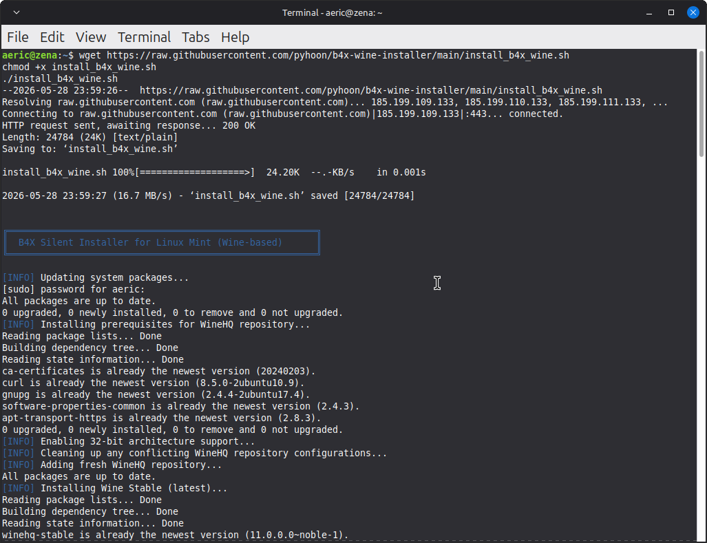

# b4x-wine-installer

<!-- 🎖️ BADGES SECTION - Place immediately after title -->
[](https://linuxmint.com/)
[](https://winehq.org/)
[](https://www.b4x.com/b4a.html)
[](https://www.b4x.com/b4j.html)
[](LICENSE)
[](https://github.com/pyhoon/b4x-wine-installer/releases)

> 🎯 Install B4A and B4J on Linux Mint using Wine with a single silent script.




<!-- 📋 Table of Contents (optional but helpful) -->
## 📑 Table of Contents
- [✨ Features](#-features)
- [🚀 Quick Start](#-quick-start)
- [⚙️ Configuration](#️-configuration-details)
- [🔧 Troubleshooting](#-troubleshooting)
- [🗑️ Uninstall B4A/B4J](#%EF%B8%8F-uninstall-b4a--b4j)
- [📚 Resources](#-references--resources)

<!-- 📝 Main content continues... -->
## ✨ Features

This script automatically:

1. Installs **Wine Stable** (latest) from official WineHQ repository
2. Installs **Winetricks** for dependency management
3. Creates a dedicated **32-bit Wine prefix** for optimal B4A compatibility
4. Installs required components:
   - `.NET Framework 4.5.2` (dotnet452)
   - `Visual C++ 2010 Runtime` (vcrun2010)
   - `DirectX 11/12 (DXVK)`
5. Downloads & installs **B4A** from https://www.b4x.com/android/files/B4A.exe
5. Downloads & installs **B4J** from https://www.b4x.com/android/files/B4J.exe
6. Downloads & extracts **JDK 19** to `C:\Java` in Wine prefix
7. Downloads & extracts **Android SDK** to `C:\Android` in Wine prefix
8. Creates **desktop launcher** with icon (menu + desktop)
9. Creates optional folders:
   - `C:\Additional Libraries\{B4A,B4J,B4X}`
   - `~/B4X_Projects` in your home directory
10. Sets appropriate permissions
11. Provides helpful terminal messages throughout

## 🖥️ System Requirements

- **Linux Mint 21.x** (Vanessa/Vera/Victoria/Virginia) or **22.x** (Wilma/Xia/Zara/Zena)
- **64-bit architecture** (with 32-bit support enabled)
- **Internet connection** for downloads
- **~4.8 GB free disk space** (Wine prefix + JDK + B4A + B4J + Android SDK + B4A Resources)
- **sudo privileges** for system package installation

## 🚀 Quick Start

### 1. Download the script
```bash
wget https://raw.githubusercontent.com/pyhoon/b4x-wine-installer/main/install_b4x_wine.sh
chmod +x install_b4x_wine.sh
```

### 2. Run the installer
```bash
./install_b4x_wine.sh
```
> 🔐 You'll be prompted for your password when `sudo` is needed.

### 3. Launch **B4A**
- From Application Menu → Search "B4A"
- Or double-click the desktop icon
- Or run manually:
```bash
WINEPREFIX="$HOME/.wine_b4x" wine "C:\\Program Files\\Anywhere Software\\B4A\\B4A.exe"
```

### 4. Launch **B4J**
- From Application Menu → Search "B4J"
- Or double-click the desktop icon
- Or run manually:
```bash
WINEPREFIX="$HOME/.wine_b4x" wine "C:\\Program Files\\Anywhere Software\\B4J\\B4J.exe"
```

## ⚙️ Configuration Details

### Wine Prefix Location
```
~/.wine_b4x/  (dedicated prefix, won't interfere with default ~/.wine)
```

### Java Configuration in B4A
After first launch, verify JDK path in B4A:
1. Go to **Tools → Configure Paths**
2. Ensure **javac.exe** field sets to: `C:\Java\jdk-19.0.2\bin\javac.exe`

## ⚙️ Post-Installation Configuration

The `b4xV5.ini` configuration file is **created by B4A on its first run**, not during installation. To respect this workflow, we provide a separate configuration script.
> Note: This step is also identical for B4J.

### How to Apply Preferenced Settings

1. **Launch B4A once** (from menu or desktop)
2. **Close B4A** (no need to create a project)
3. **Run the configurator**:
   ```bash
   wget https://raw.githubusercontent.com/pyhoon/b4a-wine-installer/main/configure_b4a_settings.sh
   chmod +x configure_b4a_settings.sh
   ./configure_b4a_settings.sh
   ```
The script automatically configures `b4xV5.ini` with optimized settings:

| Setting | Value | Purpose |
|---------|-------|---------|
| `AdditionalLibrariesFolder` | `C:\Additional Libraries` | Location for B4A library files |
| `FontName2` / `FontSize2` | `Ubuntu Sans Mono` / `15` | Editor font for better readability |
| `JavaBin` | `C:\Java\jdk-19.0.2\bin` | Path to JDK compiler |
| `logs_FontName2` / `logs_FontSize2` | `Ubuntu Sans` / `15` | Log panel font settings |
| `NewProjectDefaultFolder` | `Z:\home\USER\B4X_Projects` | Default project save location (Linux-native) |
| `PlatformFolder` | `C:\Android\platforms\android-36` | Android SDK platform reference |

### Manual Override
To edit settings after installation:
```bash
# Open the INI file in your preferred editor
nano ~/.wine_b4x/drive_c/users/\$(whoami)/AppData/Roaming/Anywhere\ Software/Basic4android/b4xV5.ini
```

You can also change the settings in B4A IDE menu `Tools` -> `Configure Paths`.

### Desktop Launcher
- Location: `~/.local/share/applications/b4a-wine.desktop` and `~/.local/share/applications/b4j-wine.desktop`
- Also copied to: `~/Desktop/b4a-wine.desktop` and `~/Desktop/b4j-wine.desktop`

## 🔧 Troubleshooting

### B4A won't start / crashes
```bash
# Reinstall critical components in the B4A prefix
export WINEPREFIX="$HOME/.wine_b4x"
winetricks -q dotnet452 vcrun2010 dxvk renderer=gdi
```

### Font rendering issues
```bash
export WINEPREFIX="$HOME/.wine_b4x"
winetricks fontsmooth=rgb corefonts
wine reg add "HKCU\Control Panel\Desktop" /v FontSmoothing /t REG_SZ /d 2 /f
```

### .NET Framework errors
```bash
# Verify .NET installation
export WINEPREFIX="$HOME/.wine_b4x"
winetricks list-installed | grep dotnet
# If missing:
winetricks -q dotnet452
```

### Reset everything
```bash
# Backup first!
mv ~/.wine_b4x ~/.wine_b4x.backup
# Then re-run the installer script
./install_b4x_wine.sh
```

## 📁 Folder Structure Created

```
~/.wine_b4x/                   # Dedicated Wine prefix
├── drive_c/
│   ├── Java/                  # JDK 19 extracted here
│   ├── Program Files/
│   │   └── Anywhere Software/
│   │       └── B4A/          # B4A installation
│   │       └── B4J/          # B4J installation
│   └── Additional Libraries/ # Optional libraries folder
│       ├── B4A/
│       ├── B4J/
│       └── B4X/
│
~/B4X_Projects/                # Default project location
~/.local/share/applications/b4a-wine.desktop  # Menu launcher
~/.local/share/applications/b4j-wine.desktop  # Menu launcher
~/Desktop/b4a-wine.desktop     # Desktop shortcut
~/Desktop/b4j-wine.desktop     # Desktop shortcut
```

## 🛡️ Security & Permissions

- Script **does not run as root** (checks and exits if attempted)
- Uses `sudo` only for system package installation
- Wine prefix owned by your user account
- All downloads use HTTPS from official sources
- No telemetry or external analytics

## 🔄 Updates

### Update Wine
```bash
sudo apt update
sudo apt install --only-upgrade winehq-stable
```

### Update B4A
1. Download latest B4A.exe from https://www.b4x.com/b4a.html
2. Run installer in the prefix:
```bash
WINEPREFIX="$HOME/.wine_b4x" wine ~/Downloads/B4A.exe
```

### Update B4J
1. Download latest B4J.exe from https://www.b4x.com/b4j.html
2. Run installer in the prefix:
```bash
WINEPREFIX="$HOME/.wine_b4x" wine ~/Downloads/B4J.exe
```

### Update Winetricks components
```bash
export WINEPREFIX="$HOME/.wine_b4x"
winetricks --update
winetricks -q dotnet452 vcrun2010 dxvk
```

## 🗑️ Uninstall B4A / B4J

To completely remove B4A or B4J and all associated files (but keeping Projects folder):

### Interactive Uninstall
B4A
```bash
wget https://raw.githubusercontent.com/pyhoon/b4x-wine-installer/main/uninstall_b4a_wine.sh
chmod +x uninstall_b4a_wine.sh
./uninstall_b4a_wine.sh --keep-projects
```

B4J
```bash
wget https://raw.githubusercontent.com/pyhoon/b4x-wine-installer/main/uninstall_b4j_wine.sh
chmod +x uninstall_b4j_wine.sh
./uninstall_b4j_wine.sh --keep-projects
```

### Options
| Flag | Description
| -------- | -------- |
`--dry-run` | Preview what will be removed (no changes)
`--force` | Skip all confirmation prompts ⚠️
`--keep-projects` | Preserve `~/B4A_Projects` folder
`--keep-wine` | Don't remove Wine/Winetricks system packages
`--verbose` | Show detailed removal actions

### Examples
```bash
# Preview before deleting
./uninstall_b4a_wine.sh --dry-run

# Uninstall but keep your projects
./uninstall_b4a_wine.sh --keep-projects

# Full silent uninstall (use with caution!)
./uninstall_b4a_wine.sh --force

# Keep both projects AND Wine packages
./uninstall_b4a_wine.sh --keep-projects --keep-wine

# Verify cleanup
ls -la ~/.wine_b4x 2>&1 | grep "No such file" && echo "✓ Prefix removed"
ls ~/.local/share/applications/ | grep b4a && echo "⚠️ Launcher still exists" || echo "✓ Launcher removed"
```

## 📚 References & Resources

- WineHQ Installation Guide for Linux Mint <sup>[linuxcapable.com](https://linuxcapable.com/how-to-install-wine-on-linux-mint/)</sup>
- B4A on Wine AppDB <sup>[appdb.winehq.org](https://appdb.winehq.org/objectManager.php?sClass=application&iId=18092)</sup>
- B4X Forum: Running B4A on Linux with Wine <sup>[www.b4x.com](https://www.b4x.com/android/forum/threads/running-b4a-and-b4j-under-linux-with-wine-fully-functional.98431/)</sup>
- Winetricks Documentation <sup>[GitHub](https://github.com/Winetricks/winetricks?spm=a2ty_o01.29997173.0.0.222555fb6auMYp)</sup>
- Wine Prefix Management <sup>[linuxconfig.org](https://linuxconfig.org/using-wine-prefixes)</sup>

## ⚠️ Disclaimer

> This script is **not officially supported or endorsed** by Anywhere Software (B4X developer) or WineHQ. Use at your own risk. Always backup important data before running installation scripts. The author is not responsible for any damage to your system.

## 🤝 Contributing

Found an issue or have an improvement?
1. Fork the repository
2. Create a feature branch
3. Submit a Pull Request

## 📄 License

MIT License - See [LICENSE](https://github.com/pyhoon/b4x-wine-installer/tree/main?tab=MIT-1-ov-file#) file for details.

---
*Last updated: 28 May 2026 | Compatible with Linux Mint 21.x / 22.x*
